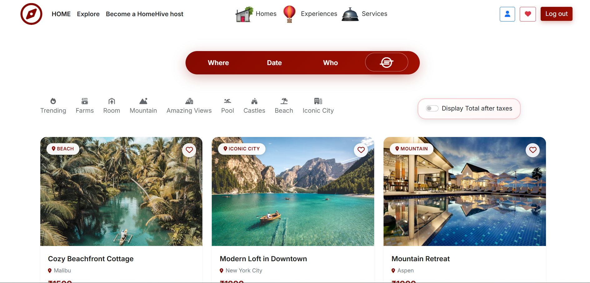
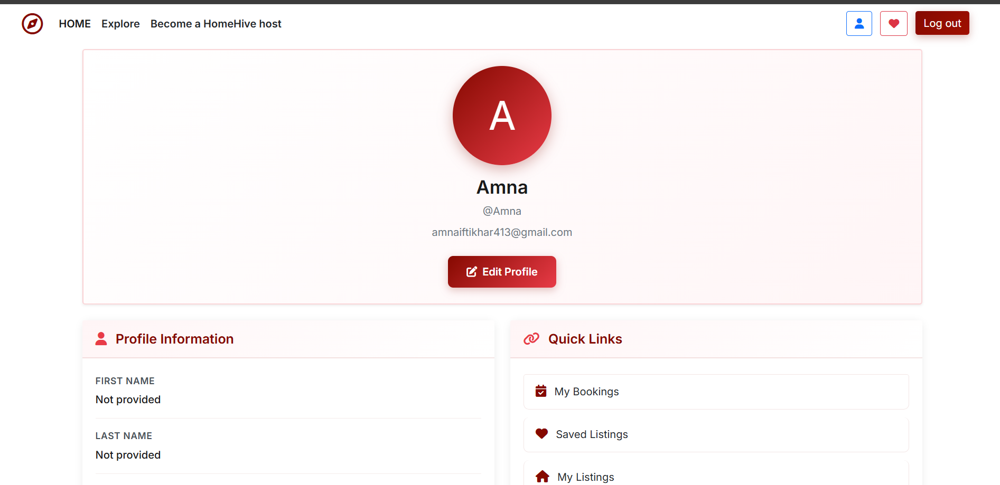
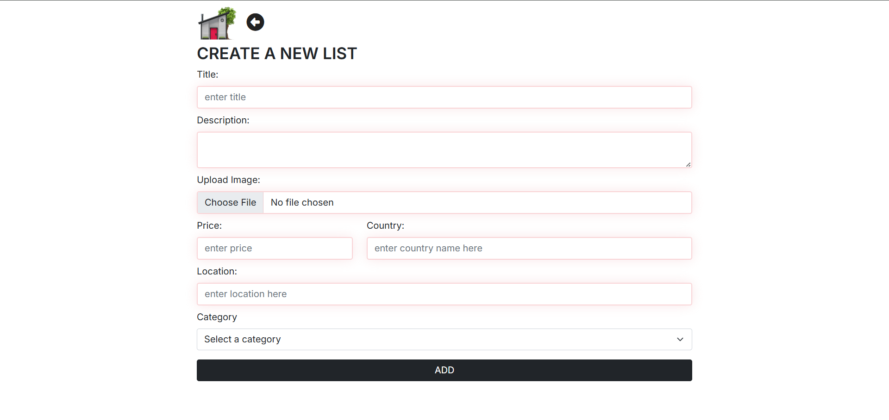
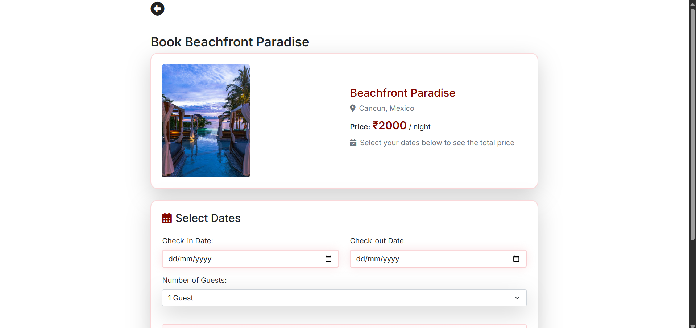
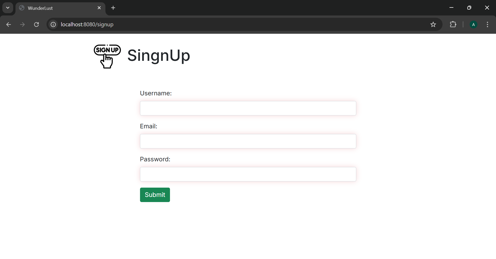

# 🌍 Wunderlust - Travel Listings Web App

> A full-stack Airbnb-inspired web application where users can explore, create, and manage travel listings with booking, reviews, and real-time map integration.

<p align="center">
  
  
  
  
  
  
</p>

---

## 📸 Screenshots

### 🏠 Homepage
<p align="center">
  
</p>

### 🏷️ User Profile
<p align="center">
  
</p>

### 📋 Add new Listing
<p align="center">
  
</p>

### ⭐ Booking
<p align="center">
  
</p>

### 🔐 Sign Up Page
<p align="center">
  
</p>

---

## ✨ Features

### 👤 User Management
- **Authentication**: Secure signup/login/logout with Passport.js
- **User Profiles**: Edit profile with bio, contact info, and profile image
- **Favorites**: Like and save listings to your personal collection
- **Authorization**: Owner-only editing and deletion protection

### 🏡 Listings
- **CRUD Operations**: Create, view, edit, and delete travel listings
- **Image Upload**: Cloudinary integration for secure image storage
- **Categories**: 9 distinct categories (Trending, Farms, Room, Mountain, Amazing Views, Pool, Castles, Beach, Iconic City)
- **Search & Filter**: Dynamic filtering by country and category
- **Geolocation**: Latitude/longitude integration with interactive Leaflet maps

### 📅 Booking System
- **Date Selection**: Intuitive calendar picker for check-in/check-out dates
- **Availability Checking**: Automatic conflict detection
- **Price Calculation**: Automated total price breakdown
- **Booking Management**: Guest and host dashboards
- **Status Tracking**: Pending, confirmed, and cancelled states

### ⭐ Reviews & Ratings
- **Star Ratings**: 1-5 star rating system with visual feedback
- **Review Comments**: Text-based reviews with timestamps
- **Cascading Deletes**: Reviews automatically removed when listing is deleted

### 🎨 User Experience
- **Responsive UI**: Mobile-first design with Bootstrap 5
- **Flash Messages**: Real-time success/error feedback with auto-dismiss
- **Sticky Navbar**: Smart navigation with scroll-collapse behavior
- **Custom Icons**: Visual category tabs with curated imagery
- **Footer Links**: Quick access to site sections and social media

---

## 🛠️ Tech Stack

| Layer | Technologies |
|-------|-------------|
| **Frontend** | HTML5, CSS3, Bootstrap 5, EJS, Vanilla JavaScript |
| **Backend** | Node.js, Express.js (v5) |
| **Database** | MongoDB, Mongoose ORM |
| **Authentication** | Passport.js, passport-local-mongoose, express-session |
| **Image Storage** | Cloudinary (cloud storage), Multer (upload handler) |
| **Validation** | Joi schema validation |
| **Maps** | Leaflet.js with CartoDB tiles |
| **Flash Messages** | connect-flash |
| **HTTP Methods** | method-override (PUT/DELETE support) |

---

## 📁 Project Structure

```
C:\airbnb\
├── app.js                      # Express entry point & middleware
├── schema.js                   # Joi validation schemas
├── cloudconfig.js              # Cloudinary configuration
├── loginauthentication.js      # Auth helper utilities
│
├── models/                     # Mongoose schemas
│   ├── listing.js              # Listing model (title, price, location, category, etc.)
│   ├── users.js                # User model (email, profile, likes, passport)
│   ├── review.js               # Review model (rating, comment, author)
│   └── booking.js              # Booking model (checkIn/Out, status, totalPrice)
│
├── routes/                     # Express route definitions
│   ├── listing.js              # Listing CRUD, search, category filter, likes
│   ├── review.js               # Review create/delete (nested under listings)
│   ├── booking.js              # Booking creation & availability checks
│   ├── bookingDashboard.js     # Guest/host booking management
│   └── user.js                 # User auth & profile routes
│
├── controllers/                # Route handler logic
│   ├── listing.js              # Listing operations & filtering
│   ├── review.js               # Review create/delete logic
│   ├── booking.js              # Booking management & conflict detection
│   └── user.js                 # User auth, profile view/edit
│
├── views/                      # EJS templates
│   ├── layouts/                # boilerplate.ejs (base HTML structure)
│   ├── includes/               # navbar.ejs, footer.ejs, flash.ejs
│   ├── listings/               # index, show, new, edit, liked, error
│   ├── user/                   # login, userform, profile, edit-profile
│   └── bookings/               # new, guest-dashboard, host-dashboard
│
├── public/                     # Static assets
│   ├── css/                    # style.css (2425 lines), rating.css
│   ├── js/                     # script.js (UI logic), map.js (Leaflet)
│   ├── images/                 # Screenshots, icons, tab graphics
│   └── favicon.ico
│
├── utils/                      # Helper functions
│   ├── asyncwrap.js            # Async error wrapper for routes
│   ├── ExpressError.js         # Custom error class
│   └── DateFormat.js           # Date formatting utility
│
├── init/                       # Database seeding
│   ├── data.js                 # 29 sample listings with Unsplash images
│   └── index.js                # Seed script (clears & inserts data)
│
├── uploads/                    # Temporary upload folder (gitignored)
├── .env                        # Environment variables (gitignored)
├── .gitignore                  # Git exclusions
└── package.json                # Dependencies & scripts
```

---

## 🚀 Getting Started

### Prerequisites

- **Node.js** (v18 or higher)
- **MongoDB** (local instance or MongoDB Atlas)
- **Cloudinary Account** (free tier available at [cloudinary.com](https://cloudinary.com))

### Installation

1. **Clone the repository**
   ```bash
   git clone <your-repo-url>
   cd airbnb
   ```

2. **Install dependencies**
   ```bash
   npm install
   ```

3. **Configure environment variables**
   
   Create a `.env` file in the root directory:
   ```env
   # Cloudinary credentials
   CLOUD_NAME=your_cloud_name
   CLOUD_API_KEY=your_api_key
   CLOUD_API_SECRET=your_api_secret

   # Environment mode
   NODE_ENV=development

   # Server Port
   PORT=8080

   # MongoDB Connection URL
   MONGO_URL=mongodb://127.0.0.1:27017/wanderlust

   # Session secret (use a strong random string)
   SESSION_SECRET=your_random_secret_key
   ```

4. **Seed the database** (optional, for sample data)
   ```bash
   node init/index.js
   ```

5. **Start the server**
   ```bash
   node app.js
   ```

6. **Open your browser**
   ```
   http://localhost:8080
   ```

---

## 📊 Data Models

### Listing
| Field | Type | Description |
|-------|------|-------------|
| `title` | String | Listing title (required) |
| `description` | String | Detailed description |
| `image` | Object | Cloudinary `{url, filename}` |
| `price` | Number | Price per night |
| `location` | String | City/region |
| `country` | String | Country name |
| `latitude` | Number | Map coordinate |
| `longitude` | Number | Map coordinate |
| `category` | Enum | Trending, Farms, Room, Mountain, Amazing Views, Pool, Castles, Beach, Iconic City |
| `reviews` | ObjectId[] | References to Review model |
| `owner` | ObjectId | Reference to User model |
| `date` | Date | Creation timestamp |

### User
| Field | Type | Description |
|-------|------|-------------|
| `username` | String | From passport-local-mongoose (required) |
| `email` | String | User email (required) |
| `firstName` | String | First name |
| `lastName` | String | Last name |
| `phone` | String | Contact number |
| `bio` | String | User bio (max 500 chars) |
| `profileImage` | Object | Cloudinary `{url, filename}` |
| `likes` | ObjectId[] | Favorited listings |

### Booking
| Field | Type | Description |
|-------|------|-------------|
| `checkIn` | Date | Arrival date (required, must be future) |
| `checkOut` | Date | Departure date (required, after checkIn) |
| `status` | Enum | pending, confirmed, cancelled |
| `totalPrice` | Number | Calculated total |
| `guests` | Number | Number of guests (min 1) |
| `listing` | ObjectId | Reference to Listing |
| `guest` | ObjectId | Reference to User (booker) |

### Review
| Field | Type | Description |
|-------|------|-------------|
| `rating` | Number | 1-5 stars (required) |
| `comment` | String | Review text |
| `author` | ObjectId | Reference to User |
| `createdAt` | Date | Auto-generated timestamp |

---

## 🔧 API Routes

### Authentication
| Method | Route | Description |
|--------|-------|-------------|
| GET | `/signup` | Show signup form |
| POST | `/signup` | Register new user |
| GET | `/login` | Show login form |
| POST | `/login` | Authenticate user |
| GET | `/logout` | Logout and clear session |

### User Profile
| Method | Route | Description |
|--------|-------|-------------|
| GET | `/profile` | View user profile |
| GET | `/profile/edit` | Edit profile form |
| PUT | `/profile/edit` | Update profile |

### Listings
| Method | Route | Description |
|--------|-------|-------------|
| GET | `/listings` | View all listings (index) |
| GET | `/listings/new` | Create listing form (auth required) |
| POST | `/listings` | Submit new listing |
| GET | `/listings/:id` | View single listing |
| GET | `/listings/:id/edit` | Edit form (owner only) |
| PUT | `/listings/:id` | Update listing |
| DELETE | `/listings/:id` | Delete listing (owner only) |
| GET | `/listings/filter/:country` | Filter by country |
| GET | `/listings/category/:category` | Filter by category |
| GET | `/listings/search` | Search listings |
| POST | `/listings/:id/like` | Like a listing |
| POST | `/listings/:id/unlike` | Unlike a listing |
| GET | `/listings/liked` | View liked listings |

### Reviews
| Method | Route | Description |
|--------|-------|-------------|
| POST | `/listings/:id/reviews` | Create review (auth required) |
| DELETE | `/listings/:id/reviews/:reviewId` | Delete review |

### Bookings
| Method | Route | Description |
|--------|-------|-------------|
| GET | `/listings/:id/bookings/new` | Booking form |
| POST | `/listings/:id/bookings` | Create booking |
| GET | `/listings/:id/availability` | Check date availability |
| GET | `/bookings/guest-dashboard` | View guest bookings |
| GET | `/bookings/host-dashboard` | View host bookings |
| PUT | `/bookings/:id/status` | Update booking status |
| PUT | `/bookings/:id/cancel` | Cancel booking |

---

## 🎯 Key Features Deep Dive

### 🗺️ Interactive Maps
Every listing detail page includes a **Leaflet.js** map with custom gradient markers. Hover over the marker to see listing details, and navigate using the smooth pan/zoom controls.

### 📅 Smart Booking Calendar
The custom-built calendar picker prevents:
- Selecting past dates
- Check-out before check-in
- Double-booking overlapping date ranges

Automatic price calculation updates in real-time as dates are selected.

### 🔒 Security Features
- **Session cookies**: HTTP-only, secure in production, 7-day expiry
- **Password hashing**: Automatic via passport-local-mongoose
- **Authorization checks**: Only listing owners can edit/delete
- **Input validation**: All forms validated server-side with Joi
- **CSRF protection**: Method-override for safe PUT/DELETE operations

### 🎨 Responsive Design
- **Mobile-first**: Bootstrap 5 grid adapts to all screen sizes
- **Custom CSS**: 2400+ lines of tailored styles
- **Hover effects**: Smooth transitions on listing cards
- **Sticky navigation**: Navbar collapses on scroll for immersive browsing

---

## 🔮 Future Enhancements

- [ ] Payment integration (Stripe/PayPal)
- [ ] Real-time chat between guests and hosts
- [ ] Advanced search with multiple filters
- [ ] Email notifications for bookings
- [ ] Multi-language support
- [ ] Admin dashboard for site management
- [ ] Social sharing for listings
- [ ] Wishlist sharing between users

---

## 📝 Scripts

```bash
# Start the server
node app.js

# Seed sample data
node init/index.js

# Run tests (not yet configured)
npm test
```

---

## 🤝 Contributing

This is a portfolio/learning project. Feel free to:
- Fork and experiment
- Report bugs or suggest improvements via Issues
- Submit pull requests with enhancements

---

## 📄 License

Copyright © 2025 **Amna Iftikhar**. All rights reserved.

This project is for **educational and portfolio purposes only**. Redistribution or reuse of this code without permission is prohibited.

---

## 🙏 Acknowledgments

- **Bootstrap** for responsive UI components
- **Cloudinary** for cloud image storage
- **Unsplash** for sample listing photos
- **Leaflet** for interactive maps
- **Font Awesome** for icons
- **Google Fonts** (Inter, Montserrat, Plus Jakarta Sans)

---

## 📧 Contact

**Amna Iftikhar**  
*Built for learning full-stack web development*

<p align="center">
  <strong>⭐ If you like this project, give it a star!</strong>
</p>
