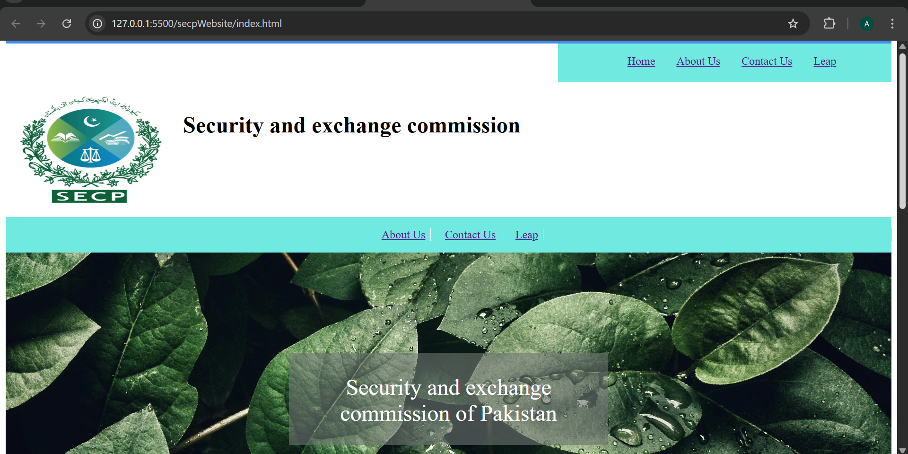
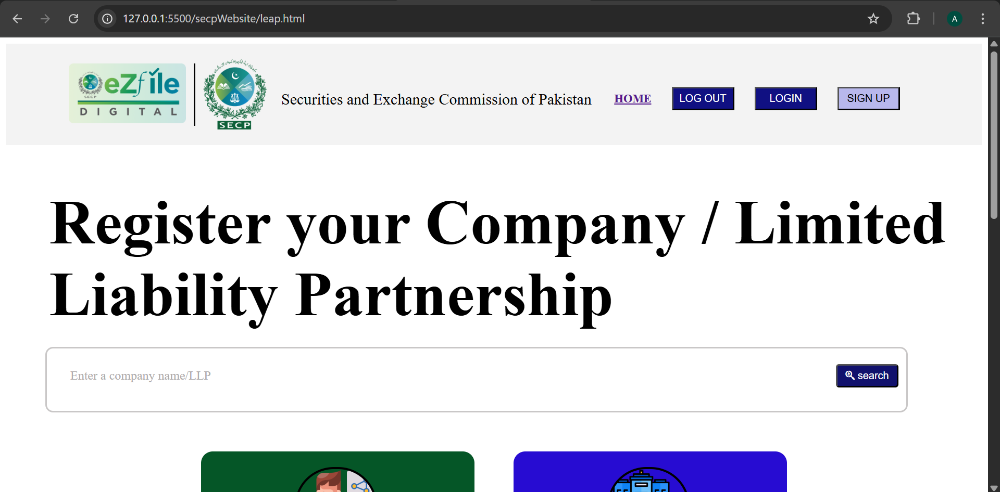
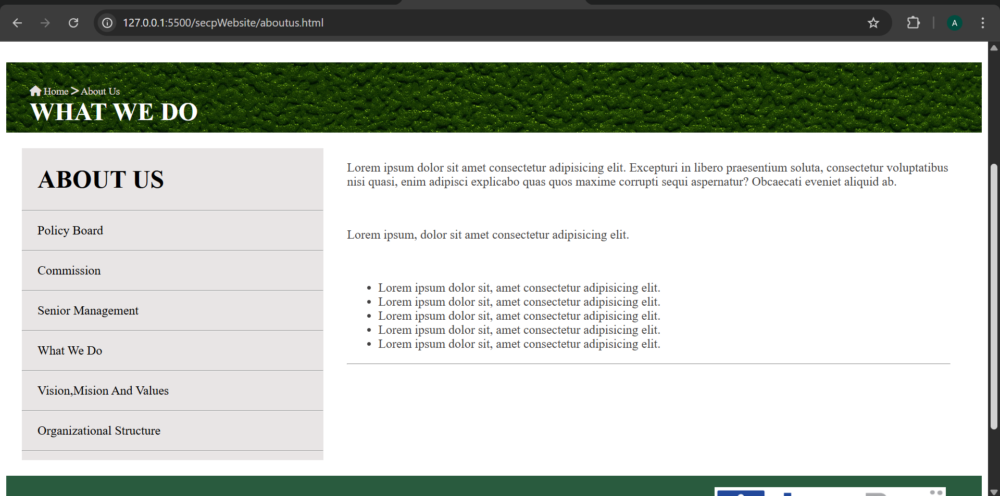
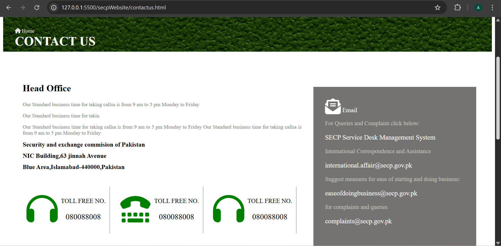
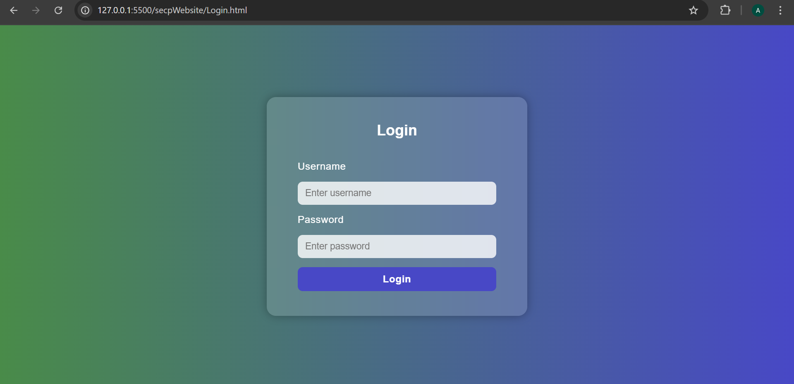

# 🏢 SECP Multi-Page Website (Full Stack: HTML, CSS, JavaScript, Node.js, MongoDB)

A modern **full-stack web application** built for the **Securities and Exchange Commission of Pakistan (SECP)**, featuring user authentication, company registration (LEAP portal), and comprehensive informational pages. This project demonstrates both **front-end and back-end** development using **HTML5, CSS3, JavaScript, Node.js, Express.js, and MongoDB**.

---

## 📋 Table of Contents

- [Features](#-features)
- [Tech Stack](#-tech-stack)
- [Project Structure](#-project-structure)
- [Screenshots](#-screenshots)
- [Installation & Setup](#-installation--setup)
- [Environment Variables](#-environment-variables)
- [API Endpoints](#-api-endpoints)
- [Database Schema](#-database-schema)
- [Learning Objectives](#-learning-objectives)
- [Author](#-author)
- [License](#-license)

---

## ✨ Features

### 🔐 Authentication System
- **User Registration** with username, email, and password
- **Secure Login** with Passport.js local strategy
- **Session Management** with cookies and express-session
- **Logout Functionality** with session cleanup
- **Flash Messages** for user feedback (success/error notifications)

### 🌐 Multi-Page Architecture
- **Home Page** - Landing page with SECP overview and navigation
- **About Us** - Company information and organizational details
- **Contact Us** - Contact details, email addresses, and complaint submission forms
- **LEAP Portal** - Company/LLP registration interface with name search functionality
- **Login/Signup Pages** - Glassmorphism-styled authentication pages

### 🎨 UI/UX Features
- **Responsive Design** - Mobile-friendly layouts
- **Glassmorphism Effects** - Modern frosted glass UI elements
- **Gradient Backgrounds** - Professional color schemes
- **Font Awesome Icons** - Visual enhancement throughout the site
- **Hover Animations** - Interactive element feedback
- **Flash Notifications** - Real-time success/error message displays

---

## 🛠️ Tech Stack

### Frontend
| Technology | Purpose |
|------------|---------|
| **HTML5** | Semantic page structure and markup |
| **CSS3** | Styling, gradients, flexbox layouts, animations |
| **JavaScript (ES6+)** | Client-side interactivity, fetch API, DOM manipulation |
| **Font Awesome 6.7.2** | Icon library for UI elements |
| **Google Fonts** | Typography (Poppins font family) |

### Backend
| Technology | Purpose |
|------------|---------|
| **Node.js** | JavaScript runtime environment |
| **Express.js 5.1.0** | Backend framework for RESTful API routing |
| **MongoDB** | NoSQL database for user data storage |
| **Mongoose 8.19.1** | MongoDB ODM for schema management |
| **Passport.js 0.7.0** | Authentication middleware |
| **passport-local-mongoose** | Simplified local strategy integration |
| **express-session 1.18.2** | Session persistence and management |
| **cookie-parser** | HTTP cookie parsing and handling |
| **cors 2.8.5** | Cross-Origin Resource Sharing configuration |
| **dotenv** | Environment variable management |
| **nodemon** | Development auto-reload utility |

---

## 📁 Project Structure

```
secp/
├── secpWebsite/                 # Frontend files
│   ├── index.html              # Homepage with SECP overview
│   ├── aboutus.html            # About Us page with company info
│   ├── contactus.html          # Contact Us page with forms
│   ├── leap.html               # LEAP company registration portal
│   ├── Login.html              # Login page with glassmorphism UI
│   ├── SignUp.html             # User registration page
│   ├── style.css               # Global stylesheet with all page styles
│   └── images/                 # Image assets
│       ├── secp-logo.png       # SECP logo
│       ├── leap-logo.png       # LEAP portal logo
│       ├── home.png            # Homepage screenshot
│       ├── leap-page.png       # LEAP page screenshot
│       ├── about.png           # About page screenshot
│       ├── contactus.png       # Contact page screenshot
│       ├── login.png           # Login page screenshot
│       ├── background.jpg      # Homepage background
│       ├── greenbackground.jpg # About page background
│       ├── sharing-file.png    # LEAP feature icon
│       ├── revenue.png         # LEAP feature icon
│       ├── printer.png         # LEAP feature icon
│       ├── building.png        # LEAP section icon
│       └── jamapunji_parkash_parmar.png # Footer branding
│
├── server/                      # Backend Node.js application
│   ├── app.js                  # Express server with routes and auth
│   ├── modal/
│   │   └── user.js             # Mongoose user schema with passport
│   ├── .env                    # Environment variables (MONGO_URI, PORT, SECRET)
│   ├── package.json            # Backend dependencies and scripts
│   └── node_modules/           # Installed dependencies
│
├── .gitignore                   # Git ignore rules
├── LICENSE                      # Copyright and license information
└── README.md                    # Project documentation
```

---

## 📸 Screenshots

### 🏠 Homepage
<div align="center">
  
</div>

### 🚀 LEAP Portal
<div align="center">
  
</div>

### ℹ️ About Us
<div align="center">
  
</div>

### 📞 Contact Us
<div align="center">
  
</div>

### 🔐 Login Page
<div align="center">
  
</div>

---

## 🚀 Installation & Setup

### Prerequisites
- **Node.js** (v14 or higher)
- **MongoDB** (local installation or MongoDB Atlas cloud database)
- **npm** or **yarn** package manager

### Step 1: Clone the Repository
```bash
git clone <repository-url>
cd secp
```

### Step 2: Install Backend Dependencies
```bash
cd server
npm install
```

### Step 3: Configure Environment Variables
Create a `.env` file in the `server/` directory:
```env
MONGO_URI=mongodb://localhost:27017/secp-database
SESSION_SECRET=your-secret-key-here
PORT=3000
```

### Step 4: Start MongoDB
**Local MongoDB:**
```bash
mongod
```

**OR** use MongoDB Atlas cloud database and update `MONGO_URI` accordingly.

### Step 5: Run the Application

**Development Mode (with auto-reload):**
```bash
cd server
npm run dev
```

**Production Mode:**
```bash
cd server
npm start
```

The server will start at: **http://127.0.0.1:3000**

### Step 6: Open Frontend Pages
Open any HTML file in your browser or use a local server:
```bash
# Using VS Code Live Server (recommended)
# Right-click on index.html → "Open with Live Server"

# Or open directly from file system
secpWebsite/index.html
```

---

## 🔑 Environment Variables

| Variable | Description | Example |
|----------|-------------|---------|
| `MONGO_URI` | MongoDB connection string | `mongodb://localhost:27017/secp-db` |
| `SESSION_SECRET` | Secret key for session encryption | `mySecretKey123` |
| `PORT` | Server port number | `3000` |

---

## 🌐 API Endpoints

### Authentication Routes

| Method | Endpoint | Description | Request Body | Response |
|--------|----------|-------------|--------------|----------|
| **POST** | `/signUp` | Register new user | `{ username, email, password }` | `{ message: "User registered successfully" }` |
| **POST** | `/login` | Authenticate user | `{ username, password }` | `{ message: "Logged in successfully", user }` |
| **POST** | `/logout` | End user session | None | `{ message: "Logged out successfully" }` |

### Response Codes
- **200 OK** - Successful operation
- **401 Unauthorized** - Invalid credentials or user not found
- **500 Internal Server Error** - Server-side error

### Example: User Registration
```javascript
fetch("http://127.0.0.1:3000/signUp", {
  method: "POST",
  headers: { "Content-Type": "application/json" },
  credentials: "include",
  body: JSON.stringify({
    username: "johndoe",
    email: "john@example.com",
    password: "securePassword123"
  })
})
.then(res => res.json())
.then(data => console.log(data));
```

---

## 🗄️ Database Schema

### User Model (`server/modal/user.js`)

```javascript
{
  username: {
    type: String,
    required: true,
    unique: true
  },
  email: {
    type: String,
    required: true,
    unique: true
  },
  // Password is handled by passport-local-mongoose plugin
  // Includes automatic hashing and verification
}
```

**Key Features:**
- **Automatic Password Hashing** via `passport-local-mongoose`
- **Unique Constraints** on username and email fields
- **Built-in Authentication Methods** (`register`, `authenticate`, `serializeUser`, `deserializeUser`)

---

## 🎓 Learning Objectives

This project demonstrates proficiency in:

### Frontend Development
- ✅ Semantic HTML5 markup and structure
- ✅ CSS3 layouts (Flexbox, gradients, glassmorphism, animations)
- ✅ Responsive design principles and mobile optimization
- ✅ JavaScript ES6+ (async/await, fetch API, DOM manipulation)
- ✅ Client-server communication with RESTful APIs
- ✅ Form validation and submission workflows
- ✅ Flash message notification systems

### Backend Development
- ✅ Node.js server setup and configuration
- ✅ Express.js routing and middleware implementation
- ✅ RESTful API design and endpoint creation
- ✅ MongoDB database integration with Mongoose ODM
- ✅ User authentication with Passport.js
- ✅ Session management and cookie handling
- ✅ CORS configuration for cross-origin requests
- ✅ Environment variable management for security
- ✅ Error handling and user feedback systems

### Software Engineering Best Practices
- ✅ Modular code organization (separation of concerns)
- ✅ Schema design and data modeling
- ✅ Security practices (password hashing, session security)
- ✅ API documentation and testing
- ✅ Version control with Git

---

## 👨‍💻 Author

**Amna Iftikhar**  
*Built for practice and learning full-stack web development.*

---

## 📄 License

Copyright © 2025 **Amna Iftikhar**. All rights reserved.

This project is for **educational and portfolio purposes only**.  
Redistribution or reuse of this code without permission is prohibited.

---

## 🙏 Acknowledgments

- **SECP** - Securities and Exchange Commission of Pakistan (project inspiration)
- **Font Awesome** - Icon library
- **Google Fonts** - Typography resources
- **MongoDB & Mongoose** - Database solutions
- **Passport.js** - Authentication framework

---

<div align="center">
  <strong>⭐ If you found this project helpful, consider giving it a star!</strong>
</div>
